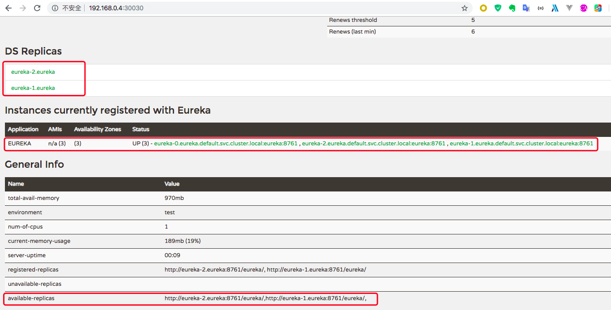

[English](README_en.md)
## 介绍
本项目目的是在`kubernetes`上方便、快捷的部署`eureka`集群。早期，有一个使用`spring cloud`开发的系统部署在`docker swarm`集群上，后来需要将该系统迁移到`kubernetes`集群上，为了能在`kubernetes`上方便部署`eureka`多实例，所以使用`statefulset`和`headless service`完成该工作。

## 使用
步骤一：Clone 项目

``` sh
git clone https://github.com/BitInit/eureka-on-kubernetes
```

步骤二：修改`k8s-eureka-prod.yml`配置信息

> `k8s-eureka-prod.yml`中默认开启 3 个`eureka`实例，如果要自定义需要做两步修改。
> 
> 第一步：修改`StatefulSet`中`replicas`为期望值`n`
> 
> 第二步：修改`ConfigMap`中数据`eureka_service_address`为`http://eureka-0.eureka:8761/eureka,...,http://eureka-(n-1).eureka:8761/eureka`

步骤三：在`kubernetes`集群上部署`eureka cluster`

``` sh
$ cd eureka-on-kubernetes
$ kubectl apply -f k8s-eureka-prod.yml
```

等待几分钟后，可以看到`StatefulSet`信息：

``` sh
$ kubectl get statefulset
NAME     READY   AGE
eureka   3/3     28m
```

`Pods`：

``` sh
$ kubectl get pods
NAME                            READY   STATUS    RESTARTS   AGE
eureka-0                        1/1     Running   0          29m
eureka-1                        1/1     Running   0          28m
eureka-2                        1/1     Running   0          28m
```

Services:

``` sh
$ kubectl get services
NAME         TYPE        CLUSTER-IP      EXTERNAL-IP   PORT(S)          AGE
eureka       ClusterIP   None            <none>        8761/TCP         16m
eureka-np    NodePort    10.110.154.67   <none>        8761:30030/TCP   16m
```

此时，可通过`Eureka UI`查看`Eureka`基本信息，URL为`http://<node-ip>:30030`：



### `eureka client`连接`eureka server`
为了连接`eureka server`，`eureka client`必须要知道`eureka server`的 ip 地址，这里提供三种方式连接`eureka server`

#### 第一种方式
`eureka client`和`eureka server`如果部署在`kubernetes`的同一个`namespace`。此时可以使用名为`eureka-cm`的`ConfigMap`的`eureka_service_address`配置数据设置 ip 地址

``` sh
# kubernetes yaml file
env:
- name: EUREKA_SERVER_ADDRESS
  valueFrom:
    configMapKeyRef:
      name: eureka-cm
      key: eureka_service_address

# application.yml
eureka:
  client:
    serviceUrl:
      defaultZone: $EUREKA_SERVER_ADDRESS
```

#### 第二种方式
`eureka client`和`eureka server`如果部署在同一个`kubernetes`集群中。此时可以使用`headless service`的域名地址，这里`eureka`默认部署在`kubernetes`的`default`的命名空间中

``` sh
eureka:
  client:
    serviceUrl:
      defaultZone: http://eureka-0.eureka.default.svc.cluster.local:8761/eureka,http://eureka-1.eureka.default.svc.cluster.local:8761/eureka,http://eureka-2.eureka.default.svc.cluster.local:8761/eureka
```

#### 第三种方式
如果`eureka client`没有部署在该`kubernetes`中，此时应使用`kubernetes`的`NodePort`方式访问`eureka server`

``` sh 
eureka:
  client:
    serviceUrl:
      defaultZone: http://<node-ip>:30030/eureka
```

## 其他
[spring-cloud-kubernetes](https://github.com/spring-cloud/spring-cloud-kubernetes)：通过`kubernetes`来支撑服务的发现与注册。

[nacos-k8s](https://github.com/nacos-group/nacos-k8s): [nacos](https://nacos.io/en-us/)是阿里开源的服务发现与注册中心、配置和服务管理的平台。