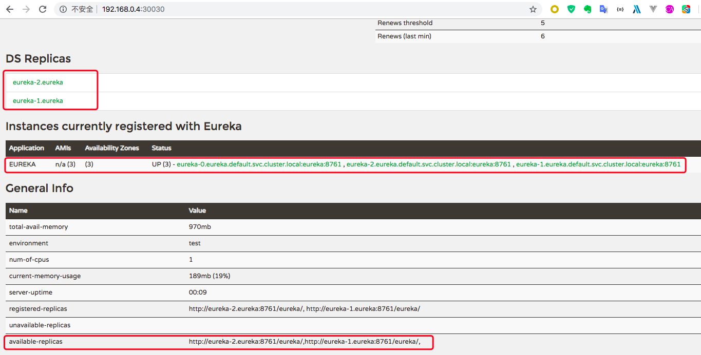

## Introduction
We have a microservice system that used spring cloud development, the system deployed on docker swarm cluster. Now, the system must be migrated from docker swarm to kubernetes, so we have to build a highly available eureka cluster. This project is a simple example to build eureka cluster on kubernetes.

## Usage
**Step 1: Clone project**

``` sh
git clone https://github.com/BitInit/eureka-on-kubernetes
```

**Step 2: Deploy eureka cluster**

``` sh
cd eureka-on-kubernetes
kubectl apply -f k8s-eureka-prod.yml
```

So you can see StatefulSet result by using `kubectl get statefulset`:

``` 
NAME     READY   AGE
eureka   3/3     28m
```

Pods:

```
$ kubectl get pods
NAME                            READY   STATUS    RESTARTS   AGE
eureka-0                        1/1     Running   0          29m
eureka-1                        1/1     Running   0          28m
eureka-2                        1/1     Running   0          28m
```

Services:

```
$ kubectl get services
NAME         TYPE        CLUSTER-IP      EXTERNAL-IP   PORT(S)          AGE
eureka       ClusterIP   None            <none>        8761/TCP         16m
eureka-np    NodePort    10.110.154.67   <none>        8761:30030/TCP   16m
```

Eureka UI: you can access eureka web page by using `http://<node-ip>:30030`.



### Client connect to server
To connect to Eureka server, client must set Eureka server address. The following shows different access Eureka server methods.

If your Eureka server and client deployed on same kubernetes namespace, so you can use configuration of ConfigMap named eureka-cm.

```
eureka:
  client:
    serviceUrl:
      defaultZone: $EUREKA_SERVER_ADDRESS
```

Or

```
eureka:
  client:
    serviceUrl:
      defaultZone: http://eureka-0.eureka.default.svc.cluster.local:eureka:8761/eureka,http://eureka-1.eureka.default.svc.cluster.local:eureka:8761/eureka,http://eureka-2.eureka.default.svc.cluster.local:eureka:8761/eureka
```

## Others
Kubernetes also can support service discovery and registration for spring cloud, the project address is [spring-cloud-kubernetes](https://github.com/spring-cloud/spring-cloud-kubernetes).

[nacos-k8s](https://github.com/nacos-group/nacos-k8s): [nacos](https://nacos.io/en-us/) is an easy-to-use dynamic service discovery, configuration and service management platform for building cloud native applications.